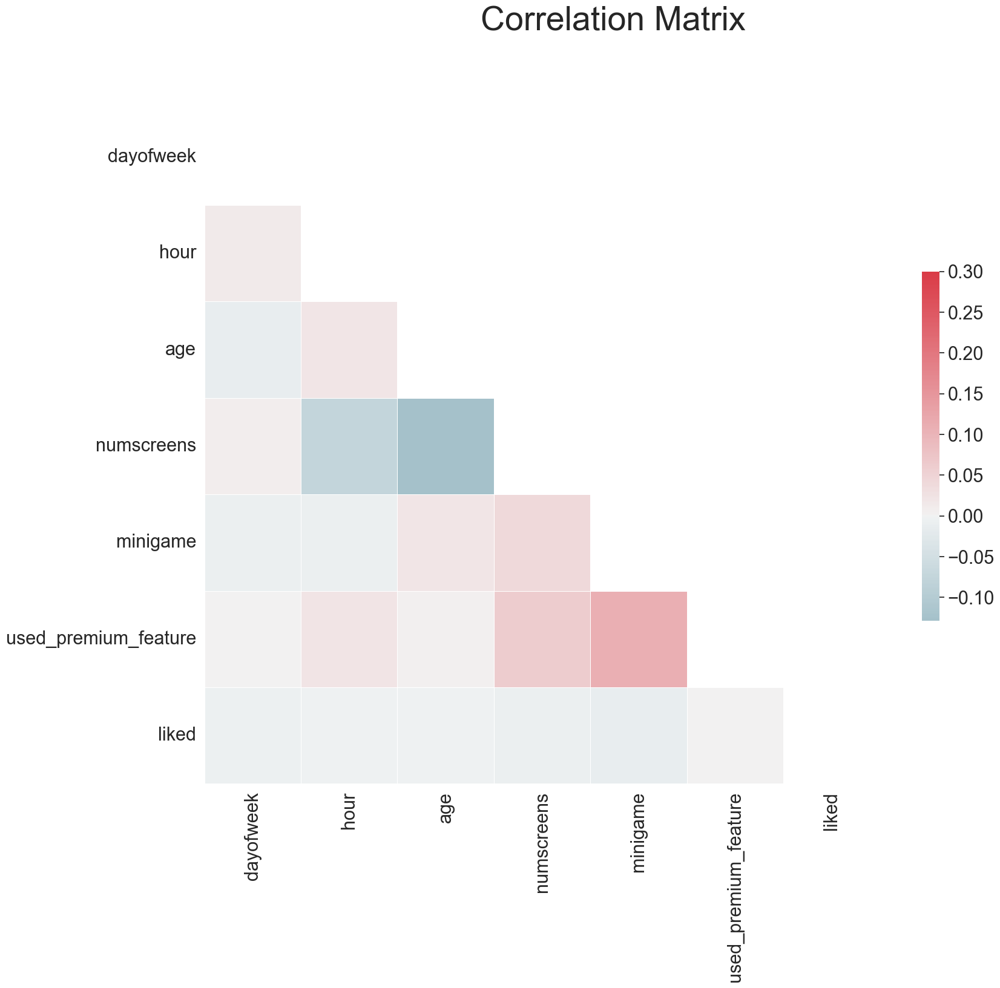
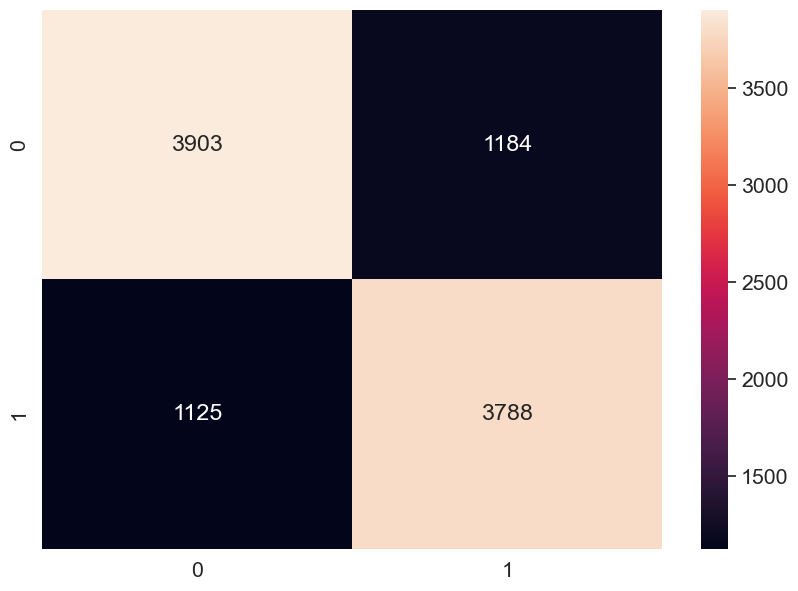

# directing-customers-to-subscription-through-app-behaviour-analysis
Directing Customers to Subscription Through App Behavior Analysis

## Project Overview

**DATA** - Customer's app behavior data, this data allows us to see the date and time of installation, as well as the features the users engage with the app. App behavior is characterized as a list of App screens the user looked at, and whether the user played the financial mini games available. The app usage data is only from the user's first day on the app.

**GOAL** - The Company wants to target the users with new offers shortly, based on the behavior of the first 24 hours free trial  of premium subscription. We're goign to predict whether the user subscribes or not.

## Tools Used
1. Python
2. Pandas
3. seaborn
4. Matplotlib
5. sklearn - Logistic Regression, Random Forest Classifier

## Model Building Process

1. Exploratory Data Analysis - plotting with matplotlib and seaborn to understand the tresnd and corelation in data
2. Data Manipulation & Feature Engineering - using pandas,numpy for formatting, and Feature selction algorithms for feature engineering
3. Classification Algorithms - experiment with Logistic Regression and Random Forest Classifier
4. Hyperparamater Tuning - Kfold Cross Validation, Grid Search, Random Search
5. Concluding the predictions and accuracies.

## Correlation Matrices

## Confusion Matrix after Logistic Regression

## Final Conclusion

**Logistic Regression** -> Accuracy: 0.7691
**Random Forest Classifier** -> Accuracy: 0.7790

**RESULTS AFTER HYPERPARAMETER TUNING**

SVM Best Accuracy: 0.7677
SVM Best Hyperparameters: {'C': 10, 'max_iter': 100, 'penalty': 'l1', 'solver': 'liblinear'}

Random Forest Best Accuracy: 0.7839
Random Forest Best Hyperparameters: {'max_depth': 19, 'min_samples_leaf': 4, 'min_samples_split': 7, 'n_estimators': 129}

